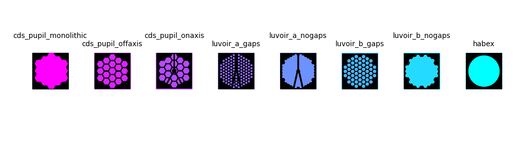

# hwo_custom_markers
Custom matplotlib markers for different telescope aperture concepts for searching for exo-Earths. LUVOIR apertures are available via ```hcipy.make_luvoir_[a,b]_aperture()``` and CDS apertures are described in Belikov et al. 2023.  SVGs included in this packaged contain no dimensional data and dimensions have been adjusted to facilitate visualization. 

## Installation instructions
### Option 1:
```bash
pip install hwo-custom-markers
```

### Option 2:
```bash
git clone git@github.com:sfr348/hwo_custom_markers.git
```
```bash
cd hwo_custom_markers
```
```bash
python setup.py
```

## Demo
```bash
import hwo_custom_markers.generate_custom_markers
import matplotlib.pyplot as plt
custom_markers = hwo_custom_markers.generate_custom_markers.get_historic_markers()
aperture_name = 'luvoir_a_nogaps'

plt.figure()
plt.plot(1,1,ls='', marker=custom_markers[aperture_name],  markerfacecolor='k', markeredgecolor='k', markersize=30)
plt.show()
```
Note if you want the mirror faces to be different colours, plot a square behind it:
```bash
plt.figure()
plt.plot(1, 1, ls='', marker='s',  markerfacecolor='m', markeredgecolor='m', markersize=30)
plt.plot(1, 1, ls='', marker=custom_markers[aperture_name], markerfacecolor='k', markeredgecolor='k', markersize=30)
plt.show()
```


Note that if the markers are small and the aperture is segmented, it may look like a black square.  If plotting small markers, it is recommended to use the un-segmented versions.


## Making additional markers
To make a new svg file that fits this format using python:
1. Generate image of aperture and save:
```bash
cmap='binary_r'
plt.imshow(aperture, cmap=cmap)
plt.axis('off')
plt.tight_layout()
plt.savefig(aperture.png,transparent=True)
```
2. Load open image in inkscape, select 'Embed', 'From file', and 'None' in the image import window
3. Select image then open Trace Bitmap window. Use 'Single Scan' and adjust brightness cutoff to reflect the desired output.  Select apply.
4. Select bitmap trace and go to Export Image window.  Select 'svg' as filetype. Tick the 'Export Selected Only' box; this sets the white to transparent and enables adjusting the mirror face colour.
5. Move svg to 'support_data' folder and name according to the convention of <aperture_name_sampling.svg>.  When the design is loaded, the sampling is discarded in the marker name.

For additional information contact sredmond@caltech.edu
